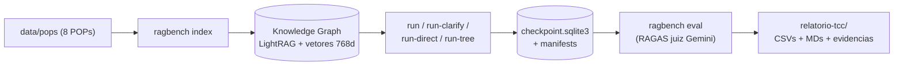
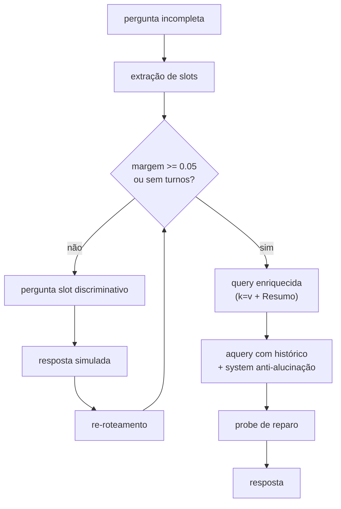

# Visão geral do TCC — benchmarking de RAG em domínio regulatório bancário

> Porta de entrada do estudo. Matriz completa em
> [`relatorio-tcc/relatorio-2-vs-8-pops.md`](relatorio-tcc/relatorio-2-vs-8-pops.md),
> desenvolvimento em
> [`relatorio-tcc/relatorio-desenvolvimento-execucao.md`](relatorio-tcc/relatorio-desenvolvimento-execucao.md),
> histórico em [`relatorio-tcc/timeline-projeto.md`](relatorio-tcc/timeline-projeto.md),
> pré-registro do desenho atual em
> [`relatorio-tcc/evidencias/criterios_fatorial.md`](relatorio-tcc/evidencias/criterios_fatorial.md).

## 1. O projeto

O `ragbench` é um framework de benchmarking para arquiteturas RAG em domínio
regulatório bancário (8 POPs), com Knowledge Graph RAG (LightRAG) e avaliação
LLM-as-a-Judge via RAGAS. Estado: branch `main`, 253 testes, cobertura 80,41%.

**Pergunta de pesquisa:** com a base de grafos, conduzir clarificação para
coletar os dados que faltam produz respostas mais acuradas do que o
single-turn direto — e o próprio grafo indica o que ainda falta perguntar?

## 2. Resultados vigentes (juiz `gemini-3.5-flash-lite`)

| Braço | Faith 24 | Faith 96 | OOD (A/dano) |
|---|---|---|---|
| Routed (grafo guiado + rota) | 0,86 | 0,55 | 20 / 18 |
| Clarify fixo | 0,69 | 0,46 | — (em medição) |
| Hybrid (grafo puro) | 0,68* | 0,41 | 18 / 23 |
| Só LLM | 0,18 | 0,15 | 12 / 37 |
| Árvore de regras | 0,86 | 0,72† | 0 / 51 |

\* n=4 no baseline 24. † Média sobre 79/96 (templates curtos sem declarações).

**Conclusão vigente em duas frases:** em distribuição, a árvore é o teto
(0,72–0,86) e o routed o melhor sistema que generaliza (0,55–0,86, +0,09/+0,17
sobre o fixo); fora de distribuição, a árvore vira o maior risco (0 FALLBACK,
dano 51) e o routed o mais seguro (20 abstenções, dano 18).

## 3. Arquitetura

- `LightRAGEngine` dual-role (index/chat) sobre transporte Gemini resiliente.
- Roteador só-grafo N-POPs: recall ponderado sobre a query + bônus de keywords
  normativas, margem como parada, estratégias por documento via settings.
- `DecisionTreeEngine`: chatbot simbólico (~1100 linhas, 8 POPs), zero LLM.
- `BenchmarkRunner`: lote com checkpoint SQLite (WAL), `--resume`, saída
  graciosa em cota (exit 3).
- Princípios: Ports & Adapters, schemas Pydantic v2, sem `dict` genérico.

## 4. Fluxo roteado (braço principal da hipótese)

## 5. Plano de testes da semana (desenho fatorial com índice condicionado)

Células `<perguntas>-<índice>`, amostragem seed 42 estratificada por tipo:

| Dia | Trabalho |
|---|---|
| D1 | `data/pops_2` + build `idx2` + sanidade ±15% + amostragem + `piloto-duo2-idx2` + OOD-fixo |
| D2 | `duo-denso-idx2` (5 braços) |
| D3 | `duo-denso-idx8` + `ood-idx2` + rúbrica OOD |
| D4 | `octeto-esparso-idx8` (5 braços) |
| D5–D7 | `octeto-denso-idx8` (2+2+1 braços; parar em 429) |
| D8 | Gráficos + `relatorio-comparativo-final.md` |

Regras: `STORAGE_DIR` por índice (`lightrag_2pops_db` vs `lightrag_ollama_db`),
`PYTHONPATH` IPv4, `--concurrency 1`, 1 eval-96/dia (cotas: juiz 500/dia,
embeddings 1000/dia), congelamento total D1–D8, gatilhos (aborto se >15%
NaN-429; sanidade idx2 ±15%).

## 6. Resultados esperados (pré-registrados, falsificáveis)

- **H1**: `duo-denso-idx2 × duo-denso-idx8` mostra queda por distração (efeito-volume puro).
- **H2**: routed × fixo pareado positivo em toda célula.
- **H3**: dano OOD menor no idx2 que no idx8.
- **H4**: densidade (2→8/POP) degrada menos que corpus (2→8 docs).
- **Falsificação**: se H1 ≈ 0, o efeito-corpus histórico era questionário, não volume.
- **Ruído**: deltas <0,05 em células n≤16 não são achados; piloto sem conclusão.

## 7. Riscos assumidos

n pequeno fora do denso; deriva do alias do juiz (janela registrada);
`octeto-esparso × idx2` excluído (documento ausente ≠ volume); NaN sempre com
`n_scored/n`; spot-check humano do OOD antes da banca (concordância ≥80%).
