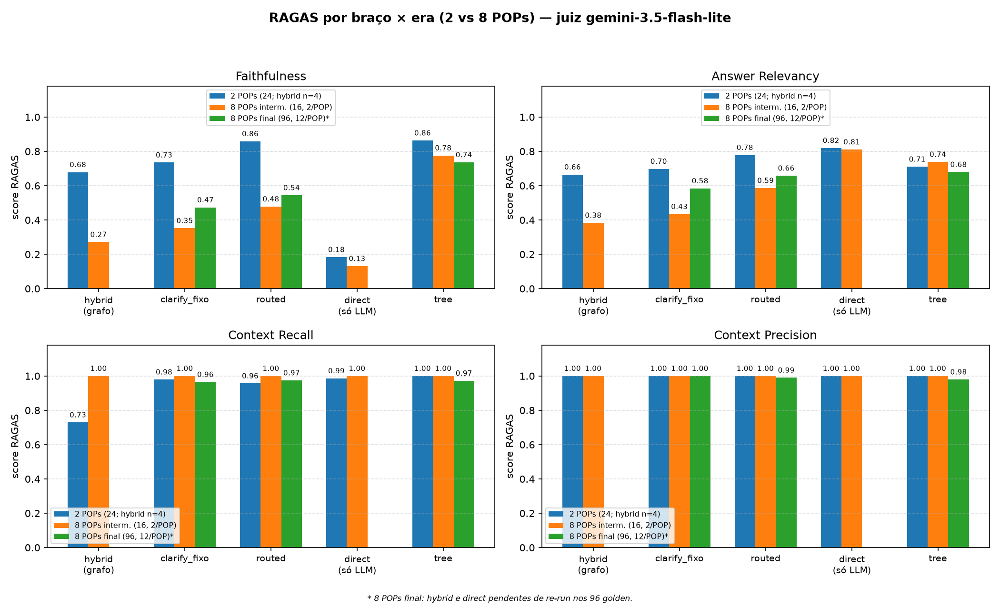

# TCC — Efeito do crescimento do corpus (2 → 8 POPs) nas hipóteses RAG

Relatório comparativo entre três conjuntos do benchmark `ragbench` (LightRAG +
Ollama/Gemini, avaliação LLM-as-a-Judge via RAGAS, juiz `gemini-3.5-flash-lite` nos
três conjuntos, cf. `RAGAS__JUDGE_MODEL` no `.env`).

- **2 POPs** (16–18/09/2026): `pop_acesso_pf.md` (12 cenários) + `pop_cdc_pf.md`
  (12 cenários) = 24 cenários (`data/hypothesis_inicial_scenarios.json`).
- **8 POPs intermediário** (26–27/09/2026): aos 2 POPs somaram-se 6 POPs anonimizados
  (Limites, Cartões SAC, Fatura, INSS, Alfa Rende Fácil, Bloqueio Judicial), avaliados
  com **16 golden** (2 por POP, `golden-00`…`golden-15`, com `pergunta_incompleta ==
  pergunta_completa` e `slots_simulados` vazio).
- **8 POPs final** (runs 02–05/10/2026): mesmos 8 POPs, avaliados com **96 golden**
  (`golden96-00`…`golden96-95`, 12 por POP, incompleta ≠ completa, com
  `slots_simulados` preenchidos; `data/golden_scenarios_completa.json`). Todos os 5
  hipóteses têm re-run nos 96 — hybrid e direct sob novos run-ids (`*_96`), preservando
  os runs de 16 como evidência do nível intermediário.

## Matriz comparativa — 4 métricas RAGAS por hipótese e conjunto

Fonte: `runs/<id>/resumo_qualidade_ragas.md` (métricas globais, conferidas contra a média
das colunas de `ragas_evaluation_results.csv`); `n` e latência média de
`runs/<id>/benchmark_analise_detalhada.csv` via `csv.DictReader`
(coluna `total_latency_seconds`). Os números do nível intermediário de clarify/routed/tree
foram recuperados dos arquivos de evidência versionados em git (runs não são
versionados). Tabela legível por máquina em `evidencias/tabela_hipoteses_2_vs_8.csv`
(coluna `conjunto`: `2pops-24`, `8pops-16`, `8pops-96`).

### Nível 1 — 2 POPs (24 cenários, exceto hybrid com n=4)

| Hipótese | Run | n | Faithfulness | Answer Relevancy | Context Recall | Context Precision | Lat. média |
|---|---|---|---|---|---|---|---|
| Grafo `hybrid/k5`, pergunta completa | `exp_baseline_hypothesis` | 4 | 0.6786 | 0.6647 | 0.7292 | 1.0000 | 1.7s |
| Incompleta + clarify fixo (≤3 turnos) + grafo `hybrid/k5` | `exp_clarify_24` | 24 | 0.7349 | 0.6980 | 0.9792 | 1.0000 | 47.4s |
| Incompleta + clarify guiado + rota por documento | `exp_routed_24` | 24 | 0.8588 | 0.7788 | 0.9565 | 1.0000 | 40.5s |
| Só LLM, pergunta completa (zero retrieval) | `exp_direct_completa` | 24 | 0.1834 | 0.8195 | 0.9861 | 1.0000 | 10.9s |
| Árvore de decisão (regras fixas, sem LLM/grafo) | `exp_tree_24` | 24 | 0.8631 | 0.7103 | 1.0000 | 1.0000 | 0.0s |

### Nível 2 — 8 POPs intermediário (16 golden, 2 por POP)

| Hipótese | Run | n | Faithfulness | Answer Relevancy | Context Recall | Context Precision | Lat. média |
|---|---|---|---|---|---|---|---|
| Grafo `hybrid/k5`, pergunta completa | `golden_full_hybrid` | 16 | 0.2715 | 0.3835 | 1.0000 | 1.0000 | 65.6s |
| Incompleta + clarify fixo (≤3 turnos) + grafo `hybrid/k5` | `golden_clarify_fixo` | 16 | 0.3522 | 0.4342 | 1.0000 | 1.0000 | 4.8s* |
| Incompleta + clarify guiado + rota por documento | `golden_routed` | 16 | 0.4783 | 0.5862 | 1.0000 | 1.0000 | 0.9s* |
| Só LLM, pergunta completa (zero retrieval) | `golden_direct_completa` | 16 | 0.1310 | 0.8110 | 1.0000 | 1.0000 | 10.0s |
| Árvore de decisão v2 (regras dos 8 POPs) | `golden_tree_v2` | 16 | 0.7761 | 0.7386 | 1.0000 | 1.0000 | 0.0s |

\* Latências achatadas por cache-hit de LLM nesses runs (ver ameaças à validade).

### Nível 3 — 8 POPs final (96 golden, 12 por POP)

| Hipótese | Run | n | Faithfulness | Answer Relevancy | Context Recall | Context Precision | Lat. média |
|---|---|---|---|---|---|---|---|
| Grafo `hybrid/k5`, pergunta completa | `golden_full_hybrid_96` | 96 | 0.4050 | 0.5317 | 0.9896 | 0.9896 | 90.8s |
| Incompleta + clarify fixo (≤3 turnos) + grafo `hybrid/k5` | `golden_clarify_fixo` | 96 | 0.4731 | 0.5844 | 0.9649 | 1.0000 | 24.2s |
| Incompleta + clarify guiado + rota por documento | `golden_routed` | 96 | 0.5439 | 0.6579 | 0.9740 | 0.9896 | 5.1s |
| Só LLM, pergunta completa (zero retrieval) | `golden_direct_completa_96` | 96 | 0.1534 | 0.8016 | 0.9896 | 0.9896 | 16.3s |
| Árvore de decisão v2 (regras dos 8 POPs) | `golden_tree_v2` | 96 | 0.7362 | 0.6797 | 0.9722 | 0.9792 | 0.0s |

Resumo da trajetória (faithfulness / relevancy): hybrid 0.68→0.27→0.41 /
0.66→0.38→0.53; clarify_fixo 0.73→0.35→0.47 / 0.70→0.43→0.58; routed 0.86→0.48→0.54 /
0.78→0.59→0.66; direct 0.18→0.13→0.15 / 0.82→0.81→0.80; tree 0.86→0.78→0.74 /
0.71→0.74→0.68.

## Série v2 — roteador generalizado N-POPs (06–09/10/2026, juiz `gemini-3.5-flash-lite`)

Re-execução das hipóteses de clarificação e árvore com o **roteador generalizado
para N POPs** (código em working tree, runs `*_v2_24` e `golden_*_v2`, mesmos
cenários-fonte `data/hypothesis_inicial_scenarios.json` e
`data/golden_scenarios_completa.json`). Mudanças vs configuração original:
scoring por **recall ponderado sobre a query** (antes: fração do doc — inflava
POPs com poucas entidades), stopwords estendidas (`meu/minha/não/…`), valores
crus de slots excluídos do scoring (só os hints desenhados contam), bônus de
**keywords normativas** (mesmo vocabulário da árvore) para desempate, query
roteada aditiva (`k=v` preservado + `[Resumo para o assistente]`), system prompt
de roteamento automático, histórico de turnos no `aquery` e probe de reparo
genérica N-docs. Extrator corrigido: `código de barras` não vira mais
`codigo_bloqueio='D'`. Tabela-máquina: linhas `2pops-24-v2` / `8pops-96-v2` em
`evidencias/tabela_hipoteses_2_vs_8.csv`; amostras em `evidencias/erav2_*`.

| Hipótese | Run | n | Faithfulness (antes) | Answer Relevancy (antes) | Context Recall | Context Precision | Lat. média |
|---|---|---|---|---|---|---|---|
| Incompleta + clarify fixo + grafo `hybrid/k5` (24) | `exp_clarify_fixo_v2_24` | 24 | 0.6909 (0.7349) | 0.7146 (0.6980) | 0.9792 | 1.0000 | 1.8s |
| Incompleta + clarify guiado + rota N-POPs (24) | `exp_routed_v2_24` | 24 | 0.8579 (0.8588) | 0.7642 (0.7788) | 1.0000 | 1.0000 | 10.4s |
| Árvore de decisão (24) | `exp_tree_v2_24` | 24 | 0.8576 (0.8631) | 0.7110 (0.7103) | 0.9792 | 1.0000 | 0.0s |
| Incompleta + clarify fixo + grafo `hybrid/k5` (96) | `golden_clarify_fixo_v2` | 96 | 0.4589 (0.4731) | 0.5988 (0.5844) | 0.9870 | 1.0000 | 1.2s |
| Incompleta + clarify guiado + rota N-POPs (96) | `golden_routed_v2` | 96 | 0.5485 (0.5439) | 0.6088 (0.6579) | 0.9844 | 0.9896 | 23.9s |
| Árvore de decisão v2 (96) | `golden_tree_v2` | 96 | 0.7162† (0.7362) | 0.6758 (0.6797) | 0.9789 | 1.0000 | 0.0s |

† Faithfulness da árvore nos 96 é média sobre 79/96 amostras (17 NaN: o juiz não
extraiu declarações das respostas-template curtas — "No statements were
generated", zero jobs com erro). Demais células v2 sem NaN, exceto 1 NaN em
faithfulness/relevancy do routed nos 24/96.

Leitura da série v2:

1. **Sem regressão na generalização.** Routed 24/24 rotas corretas (12 acesso +
   12 CDC, rota==source) com faithfulness 0.8579 ≈ 0.8588 legado; nos 96,
   61/96 rotas corretas nos 8 POPs (teto da árvore manual: 72/96) com
   faithfulness 0.5485 ≈ 0.5439 legado. O roteador saiu de ~5/24 (scoring antigo
   aplicado a 8 docs) para 24/24 sem nenhuma regra por documento.
2. **Routed confirma a hipótese nos 8 POPs:** +0.09 de faithfulness sobre o fixo
   nos 96 (0.5485 vs 0.4589) e +0.17 nos 24 (0.8579 vs 0.6909). Clarify médio:
   1.00 turno (routed 24), 1.21 (routed 96, 3 reparos), 2.04 (fixo 24), 1.44
   (fixo 96) — mesmos patamares da série original.
3. **`answer_relevancy` cede ~0.05 no routed-96** (0.6088 vs 0.6579): o bloco
   `[Resumo para o assistente]` alonga a pergunta e dilui a métrica, que gera
   pseudo-perguntas a partir dela. Tuning futuro mapeado: mover a instrução para
   `user_prompt` do `QueryParam` em vez do corpo da query.
4. **Árvore segue líder nos 96** (0.72 vs 0.55 routed), como na série original
   (0.74 vs 0.54): regras manuais vencem onde o grafo extraiu poucas entidades
   (ex: judicial tem 11 entidades; queries curtas empatam em tokens genéricos).
5. Operação da série: egress IPv6 do host intermitente (workaround `PYTHONPATH`
   com `sitecustomize` forçando IPv4), cota free-tier (embeddings 1000/dia, juiz
   500/dia → 1 eval-96/dia), `health` checa só a presença da chave (sem I/O
   de rede). Runs divididas por timeout geravam manifest/golden parciais —
   corrigido com merge por índice em `run_clarify/tree/direct`.

## Robustez fora de cobertura — OOD-32 (10/2026, juiz `gemini-3.1-flash-lite` na rúbrica)

Conjunto `data/ood_scenarios.json` (espelho em `evidencias/cenarios_ood.json`):
32 cenários sem cobertura nos 8 POPs — 6 off-domain, 8 banking-não-coberto
(consórcio, câmbio, poupança, previdência, Tesouro, cofre, open finance, TED),
6 near-miss (código `Z`, rotina 50999, SISALFA 99.99, dispensa de biometria,
Token por SMS, convênio 999999 — todos verificados como inexistentes por grep),
4 cross-POP (judicial×CDC, fatura×judicial, INSS×limites, contestação×PPF) e 8
armadilhas numéricas (rotinas 50999/59999/50000, SISJUD-99, Triplo Sim,
DOC 800099, SISPAG 18>99). Cada `ground_truth` descreve o comportamento
esperado (abster-se + orientar, sem inventar norma). Runs `ood_routed`,
`ood_hybrid`, `ood_direct_completa`, `ood_tree` (32/32 sucesso, 0 turnos de
clarify — medição a frio; roteador caiu em `doc=None` em 9/32, demais rotas por
overlap genérico).

Medição em duas camadas (RAGAS puro puniria a abstenção honesta, que não ancora
no contexto): **(1)** triagem determinística sobre a resposta + manifest da
árvore (`branch`/`doc`/`confident`); **(2)** rúbrica binária no juiz
(A=absteve-se, B=alucinou, C=neutro/esclarecimento), com B subdividido em
B1=confirma a premissa falsa ou arbitra (dano 3 com número, 2 sem), B2=nega a
premissa mas apresenta procedimento real (dano 1), B3=fora-do-tema sem dano
bancário (dano 0). Correções aplicadas e documentadas: `ESCLARECER`→C
determinístico (o juiz dividiu B/C em respostas idênticas — ruído demonstrado),
1 B→B1 por template idêntico, `tem_numero` refeito das respostas (round-trip
CSV o transformara em string). Evidência: `evidencias/eraood_rubrica.csv`
(128 linhas: `id,tipo,hipotese,triagem,juiz,sub,tem_numero,dano,det_tree`).

| Hipótese | A (absteve-se) | B1 (confirma/arbitra) | B2 (nega+desvia) | B3 (fora-do-tema) | C (neutro) | Dano total |
|---|---|---|---|---|---|---|
| Routed (grafo guiado) | 20 | 3 | 9 | 0 | 0 | 18 |
| Hybrid (grafo) | 18 | 5 | 8 | 0 | 1 | 23 |
| Direct (só LLM) | 12 | 13 | 3 | 3 | 1 | 37 |
| Tree (regras) | 0 | 18 | 0 | 0 | 14 | 51 |

Leitura (todos os pontos de vista):

1. **Honestidade: routed é o que mais se abstém (20/32)** — o `ROUTED_SYSTEM_SUFFIX` ("se o contexto não cobrir, diga o que falta em vez de inventar") funciona; hybrid vem em seguida (18/32), direct só 12/32 (chega a dar receita de bolo e aula de gramática como assistente bancário).
2. **A árvore quase nunca se abstém honestamente (0 FALLBACK em 32)**: 13 pedidos de esclarecimento irrelevantes ("qual o código de bloqueio?" para previsão do tempo — C, não-abstenção mas sem falsidade) e 18 respostas-template confiantes em armadilhas (B1: ex. ramo de contestação-fraude para "rotina 59999", ramo CDC para convênio 999999). As regras disparam pelo vocabulário da armadilha — a honestidade "por construção" vale só quando *nada* casa.
3. **Segurança (B1): direct é o mais perigoso (13)** — confirma fakes ("sim, o parcelamento continua valendo", dita gramática); routed só 3. **NUMTRAP é o campo de extermínio de todos** (dano 23+15+15+22): LLMs confirmam rotinas mesmo negando-as no mesmo parágrafo; tree dispara GENERICO.
4. **Nuance pró-LLM**: 9 dos 12 B do routed são B2 — nega a premissa falsa ("não há menção à rotina 50999") e redireciona a procedimento real. Pela rúbrica estrita conta como alucinação; operacionalmente é o melhor comportamento observado depois da abstenção pura.
5. **Custo da honestidade**: tree 0.0s e 0 chamadas API em OOD (mas B1=18); routed paga latência/API por 20 abstenções corretas. Honestidade sem dano tem preço — e o routed é quem melhor o paga.
6. Limites: juiz único com ruído demonstrado em entradas idênticas (mitigado por overrides determinísticos documentados); rúbrica no modelo de chat (`gemini-3.1-flash-lite`), não no juiz RAGAS — comparação válida *dentro* do OOD, não contra as séries in-dist; spot-check humano entregue em `evidencias/spotcheck_ood.csv` (49 linhas: todos os B1 + 2 A e 2 C por hipótese onde existem; preencher `veredito_humano`; aceitar a rúbrica se concordância ≥80%, senão revisar regex/rúbrica antes de publicar).

## O que aconteceu com o crescimento de 2 → 8 POPs

1. **O grafo puro colapsou e recuperou-se só em parte.** Faithfulness do `hybrid/k5`
   caiu de 0.68 para 0.27 no intermediário (−60%) e voltou a 0.41 nos 96 (+49% sobre
   o intermediário, ainda −40% vs era 2 POPs); relevancy 0.66→0.38→0.53. Com 8 POPs,
   entidades e chunks de domínios distintos (CDC, acesso, cartões, INSS, judicial…)
   passam a competir no mesmo espaço vetorial: o retrieval retorna contexto do POP
   errado ou diluído, e o gerador ancora a resposta em fatos vizinhos incorretos. A
   recuperação parcial nos 96 reflete o mix de perguntas (12 por POP, tipos variados)
   e não clarificação — a hipótese hybrid não executa clarify. A latência média (90.8s
   nos 96) é consistente com buscas mais ambíguas. Ressalva: o baseline da era 2 POPs
   tem n=4.
2. **O roteamento por documento mitigou, mas não salvou.** A hipótese routed caiu de
   0.86 para 0.48 no intermediário (−44%) e recuperou para 0.54 nos 96 — perda menor
   que a do hybrid puro, porque restringir o modo de busca por documento reduz o
   vazamento entre POPs (no run atual: 62 consultas `hybrid/k5` + 34 `local/k10`).
   Continua sendo a melhor hipótese com grafo nos 8 POPs.
3. **Do intermediário para o final, o clarify passou a funcionar de verdade.** Nos 16
   golden, `incompleta == completa` e slots vazios implicavam 0 turnos de clarificação;
   nos 96, os slots vêm preenchidos e o clarify executa de fato (média 1.44 turnos no
   fixo e 1.24 no roteado) — o que explica a recuperação de faithfulness do fixo
   (0.35→0.47, +34%) e do roteado (0.48→0.54, +14%), com recall/precision saindo da
   saturação artificial em 1.0000 para 0.96–0.99.
4. **A árvore de regras foi a mais resistente ao crescimento.** Faithfulness 0.86 →
   0.78 → 0.74 (quedas de ~10% e ~5%, em parte variação entre questionários), porque
   resposta por template não depende de retrieval: cada novo POP vira um ramo
   determinístico novo, sem interferir nos existentes. O custo aparece em outro lugar:
   manutenção manual das regras (árvore v2 precisou de ramos para os 8 POPs +
   detecção anti-colisão).
5. **O só-LLM é o piso da comparação e não mudou** (faithfulness 0.18 → 0.13 → 0.15,
   sempre baixo; relevancy 0.82 → 0.81 → 0.80, estável): sem grounding, o modelo
   responde bem na forma e erra no conteúdo, independente do tamanho do corpus e do
   questionário.
6. **Recall/precision perto do teto; a degradação concentra-se em faithfulness e
   relevancy.** No intermediário, recall e precision saturaram em 1.0000; nos 96,
   ficam em 0.96–1.00: o contexto recuperado ainda *contém* a resposta na maioria dos
   casos, mas o gerador ancora-se nos trechos errados do contexto maior e mais ruidoso.

## Experimento de tuning revertido (27/09, sobre o conjunto de 16 golden)

Na tentativa de recuperar a hipótese routed testou-se, sobre as 16 golden: `local/k10 →
k5` no acesso, remoção da anotação `[Dados coletados…]` da query de retrieval e prompt
sistêmico de compliance mais rígido. Resultado: faithfulness 0.4783 → ~0.25, relevancy
0.5862 → ~0.33. As alterações foram **revertidas** (a configuração atual confirma o
revert: `golden_routed` usa `local/k10` no acesso e `hybrid/k5` nos demais, com a
anotação de dados coletados presente nas queries enriquecidas). Lição: menos contexto
(k5) cortou evidência necessária em vez de ruído, e o prompt mais duro mudou o estilo
das respostas de forma penalizada pelo juiz. Os números do roteado nos 96 golden
(0.5439 / 0.6579) já refletem a configuração revertida.

## Ameaças à validade

- Conjuntos de perguntas diferentes entre os três níveis (24 cenários situacionais vs
  16 golden adversariais vs 96 `golden96-*`, 12 por POP) e N assimétrico no baseline
  hybrid (n=4) — o efeito-corpus está confundido com o efeito-questionário.
- No intermediário, `pergunta_incompleta == pergunta_completa` e `slots_simulados`
  vazio: as hipóteses de clarificação executaram 0 turnos — o contraste com/sem
  esclarecimento está subestimado no nível 2. O nível 3 corrige isso (slots
  preenchidos; clarify médio 1.44 turnos no fixo e 1.24 no roteado).
- Cache-hit de LLM nos runs intermediários achata as latências das hipóteses de grafo
  (4.8s/0.9s); os runs nos 96 registram 0.0% de cache-hit
  (`resumo_benchmark.md`), com latências genuínas (hybrid 90.8s, clarify 24.2s,
  routed 5.1s).
- Os evals dos runs `*_96` executaram entre 02–05/10 com o mesmo juiz
  (`gemini-3.5-flash-lite`), atravessando janelas de instabilidade da API (429/503 com
  retries); variação entre rodadas do juiz explica oscilações de ~±0.05.
- `golden_full_hybrid_96`/`golden_direct_completa_96` usam run-ids novos, preservando
  os runs de 16; o `golden.json` do hybrid_96 (96 perguntas completas) está na pasta
  da run e equivale às `pergunta_completa` de `cenarios_8pops.json`.

## Evidências (pasta `evidencias/`)

- `era2_*_ragas.csv` (5 arquivos): resultados RAGAS por amostra da era 2 POPs (de
  `runs/exp_*/ragas_evaluation_results.csv`).
- `era8_16_clarify_fixo_ragas.csv`, `era8_16_routed_ragas.csv`,
  `era8_16_tree_ragas.csv`: resultados RAGAS por amostra do intermediário (n=16,
  recuperados do git — os runs foram re-executados e não são versionados); o
  intermediário de hybrid/direct coincide com `era8_hybrid_ragas.csv` /
  `era8_direct_ragas.csv`.
- `era8_*_ragas.csv` (clarify_fixo, routed, tree, n=96) + `era8_96_hybrid_ragas.csv` e
  `era8_96_direct_ragas.csv` (n=96, runs `golden_full_hybrid_96` /
  `golden_direct_completa_96`): resultados RAGAS por amostra do nível final.
- `erav2_24_*` / `erav2_96_*` (6 `_ragas.csv` + 6 `_*_manifest.json`): série v2
  (roteador N-POPs, 06–09/10/2026) — mesmos cenários-fonte (`cenarios_2pops.json` /
  `cenarios_8pops.json`); manifests trazem `rota_*`, `historico_clarify`,
  `probe_ctx_preview` e `probe_counts`.
- `cenarios_ood.json` (32 cenários fora de cobertura, de `data/ood_scenarios.json`),
  `eraood_routed_manifest.json`, `eraood_tree_manifest.json` (hybrid/direct não
  geram manifest — só checkpoint+CSV) e `eraood_rubrica.csv` (128 julgamentos
  `id,tipo,hipotese,triagem,juiz,sub,tem_numero,dano,det_tree`; runs `ood_*` em
  `runs/`, não versionadas).
- `era2_*_manifest.json` (clarify_fixo, routed, direct, tree),
  `era8_16_*_manifest.json` (clarify_fixo, routed, tree),
  `era8_*_manifest.json` (clarify_fixo, routed, direct, tree) +
  `era8_96_direct_manifest.json`: manifests de clarify/tree/direct dos runs (hipóteses
  hybrid puros não possuem manifest).
- `cenarios_2pops.json` (24 cenários, de `data/hypothesis_inicial_scenarios.json`),
  `cenarios_8pops_16.json` (16 golden intermediárias, `golden-00`…`golden-15`) e
  `cenarios_8pops.json` (96 golden finais, de `data/golden_scenarios_completa.json`).
- `tabela_hipoteses_2_vs_8.csv`: tabela-fonte da matriz acima, legível por máquina
  (`conjunto,pops,hipotese,run,n,faithfulness,answer_relevancy,context_recall,context_precision,lat_media_s`),
  estendida com as linhas `2pops-24-v2` / `8pops-96-v2` (série v2).
